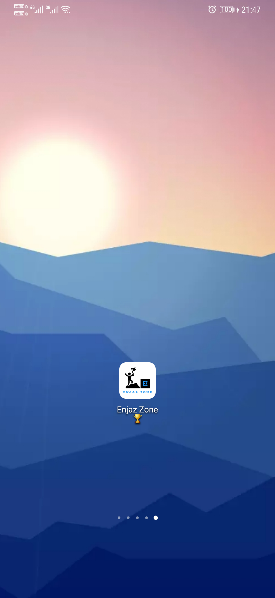
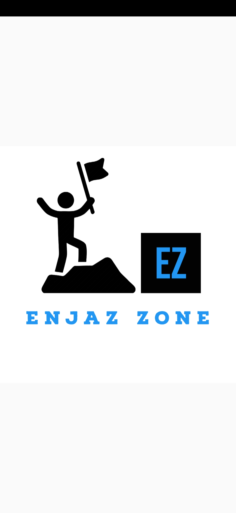
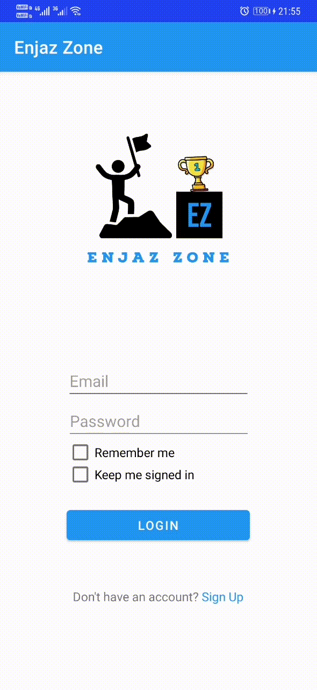
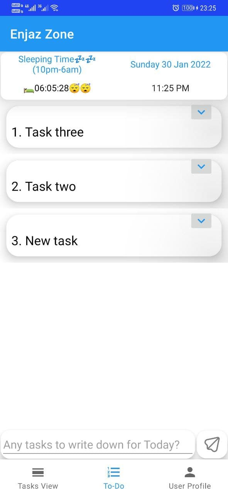
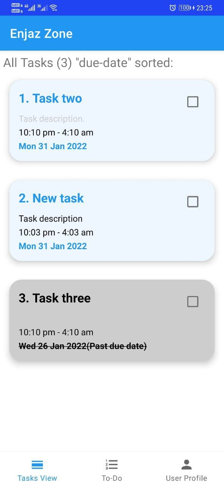
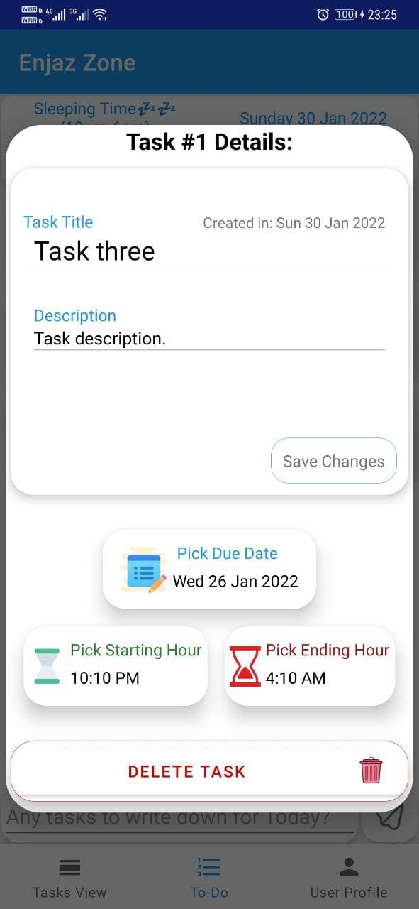
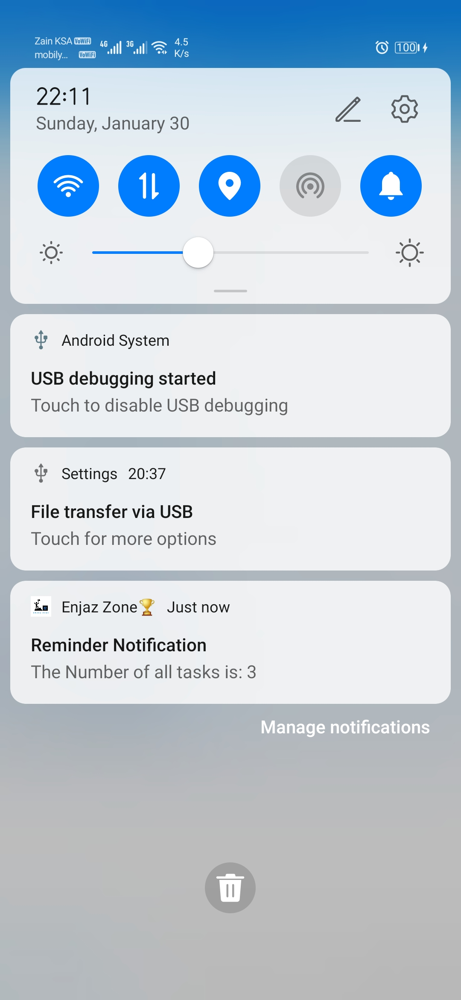
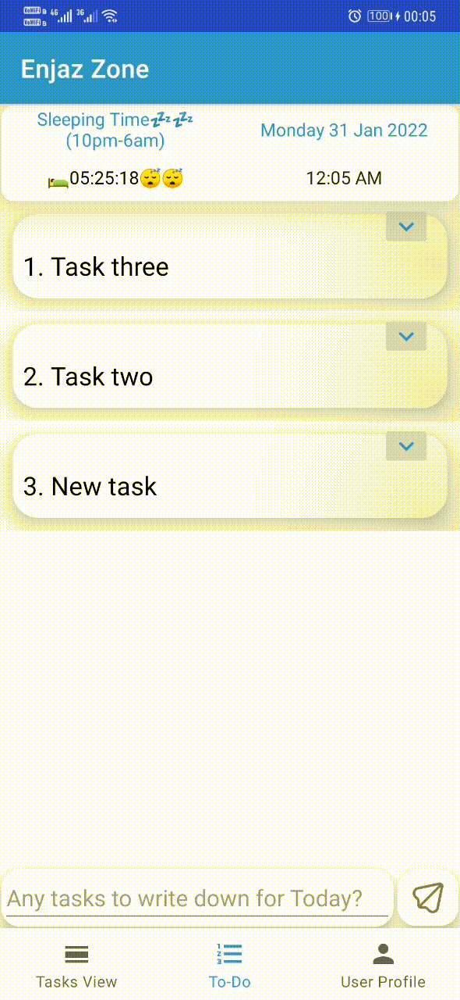

### Tuwaiq-1000 Program: Jeddah Kotlin1 (Sep2021) ###

# Enjaz Zone Application:
is an android application in Kotlin programming language and XML language,
it is developed for SFCSP's Tuwaiq academy 1000 program (Kotlin track), as final individual project,
in approximately month and half of the period: 26th September of 2021 to 27th January of 2022.
----

## Application Idea:
The start, as the time of project submission, it's a to-do task or checklist in one application, emphasizing in its (practical & visual) design on encouraging the user to finish his tasks and achieve his goals,
Which was aimed and will be aiming to implement "self-development" rules, concepts and theories (i.e: S.M.A.R.T goals, Keep It Simple rule, 7/14-minutes pill of fighting procrastination, 30 minutes/5 minutes of effective work rule, display motivational quotes and messages... etc.),
as I am aiming to keep on developing this app for my personal use, ان شاءالله.
----

### Application Code Architecture and Design Pattern:Implemented Kotlin+Android-Studio Concepts/Chapters:
Repository + MVC & MVVM
----

#### Highlights of implemented Concepts, Libraries & Technologies:
- Kotlin: Coroutine
- Google firebase: Authentication & Firestore
- Google android material: BottomNavigationView + NavigationView
- Java: java.util: Date & Format + java.text.SimpleDateFormat
- Android:
- Navigation: navigation component + NavController, fragment.findNavController
- CountDownTimer
- Widget: CardView,  MaterialCardView & RecyclerView
- Data: Lifecycle: viewmodel & Livedata + Shared Preference
- Recycler View List
- Fragments
- Fragments Navigation
- View Model
- Repository Pattern
- Live Data
- Parcelize
----

##### :camera_flash: Screenshots
----
# Screenshots of application pages(10):
# 1.App Icon

--
# 2.Splash Screen

--
# 3.Login Page

--
# 4.Login & Signup Pages gif

--
# 5.Main Page(Todo-list)

--
# 6.Second Main Page(Tasks View)

--
# 7.Third Main Page(Task Details Dialog Page)

--
# 8.Fourth Main Page(User Profile Page)

--
# 9.Tasks View Page with Heads-up Notification

--
# 10.Drawer Notification

----

## Gifs of application pages(4):
# 1.Simple To-do List (add, edit, delete & check) gif

--
# 2.Tasks View Page gif

--
# 3.Changing Preference of Bedtime Schedule gif

--
# 4.Logging-in and Sign-up Pages gif 

----

### End of File ###